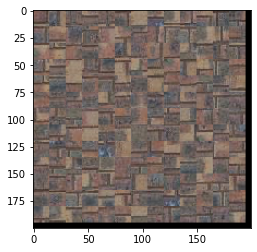

# Image Quilting

## **Randomly Sampled Texture**

#### Sample Image

#### Output Image

## **Overlapping patches**

### Images

#### Sample Image

#### Output Image

## **Seam Finding**

### Images

#### Sample Image

#### Output Image

### Illustration

#### The Two Overlapping portions

#### Pixelwise SSD Cost

#### Horizontal Mask

#### Vertical Mask

#### Combination Mask

## **Texture Transfer** 

### Two texture transfer results

#### Image 1

##### Input texture

##### Target image

##### Output Image

#### Image 2

##### Input texture

##### Input Image

##### Target Image

### Face-in-toast image

#### Input Image

#### Input Texture

#### Output Image

